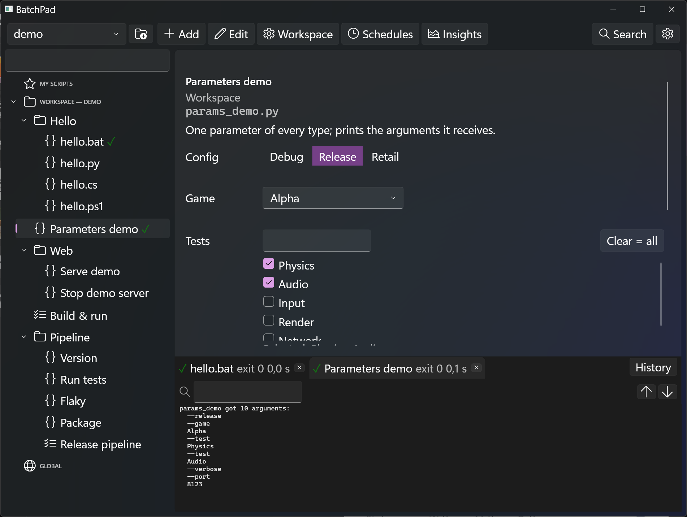

# 🛠️ BatchPad

BatchPad is a Windows desktop launch pad for the scripts a project accumulates:
build scripts, test runners, packaging and deploy scripts, and local web servers
you start and stop. Instead of digging through directories and remembering
which flags each script takes, you pick a script from a tree, set its
parameters in a form, and run it. Its output streams into the app.

Windows Batch (`.bat`/`.cmd`), Python (`.py`), C# (`.cs`), PowerShell (`.ps1`)
and plain executables are all first-class.



> **A hobby project.** BatchPad is built in spare time for the author's own
> use and shared as is, under the MIT license. Expect rough edges and very
> little support: issues and pull requests are welcome but may get a slow
> answer or none. If you need something changed, forking is encouraged.
>
> **Status:** the MVP, v1, and telemetry and coding-agent features are
> built. See
> [docs/DESIGN.md](docs/DESIGN.md) for the design and the roadmap.

## Features

- **Configure in the app, not in JSON.** Save a script into a script folder
  and it appears in the tree, with its name, description and parameters
  detected from the file. Parameters, pickers, workflows and links are all
  edited in the UI.
- **Workspaces.** Each project keeps a `batchpad.json` in its repository,
  listing the project's scripts. One BatchPad install serves any number of
  projects.
- **Global scripts.** Scripts you use everywhere live in a per-user global
  library that appears in every workspace.
- **My Scripts.** Drag any shared script into your personal tree and adjust its
  parameters, for example *Build Release & run SpaceTrader*. Your version is
  stored per user and never touches the shared config.
- **Parameters, not command lines.** Scripts declare their flags, choices and
  values, and BatchPad turns them into a form. A live preview shows the exact
  command it will run.
- **Many projects in one repo.** Shared pickers for *which app* and *which
  config* drive build, run, web-serve and package scripts alike. Choices are
  read from the project itself (build scripts, CMake lists, folders), and
  checklists pick all or some tests and benchmarks.
- **Workflows.** Chain scripts into a pipeline in the app (build → run,
  build → test → report), with conditions, a step that runs once per picked
  item, parallel groups, values handed from one step to the next, retries for
  flaky steps, and "Re-run from the failed step".
- **Schedules and triggers.** Run a script or workflow on a timetable (cron,
  every N minutes, once at a time), when files change, when BatchPad starts or
  after another run. While schedules are enabled, closing the window keeps
  BatchPad in the tray, and a failed scheduled run raises a notification.
- **History.** Every run is recorded with its values and log; the tree shows
  each script's last result, and any past run can be run again.
- **Readable output.** ANSI colours, error lines highlighted, clickable
  `file:line` locations, search, F8 to the next error, and a test-results view
  for scripts that write JUnit XML.
- **Safe to run together.** Named locks queue runs that must not overlap,
  across the app, the command line and agents, and `dependsOn` runs a
  script's prerequisites first.
- **Insights.** See where the time goes: per-script medians, trends and
  failure rates, time by folder, tag and trigger, repeated runs, and slow or
  flaky tests. Optionally forward every run to a monitoring backend.
- **Built for coding agents.** JSON output, errors-only output, run
  attribution and an MCP server let agents such as Claude Code build and
  test through the same named scripts you use.
- **Long-running processes.** Servers and watchers show a running indicator,
  open their URL when ready, and stop from the app, through a matching stop
  script or by ending the whole process tree.
- **Links.** Keep web pages, report files and folders in the same tree as the
  scripts.
- **Honest results.** Output is captured live and every run shows its exit
  code. A failed build shows as failed.
- **Standalone.** One self-contained executable that depends on nothing in the
  projects it serves.

Not there yet: exporting schedules to Windows Task Scheduler, benchmark
result comparison, and Windows shell integration (jump lists, taskbar
progress). Also open: reading unattended secrets from Windows Credential
Manager, and a command-line way to trust a workspace. See
[docs/DESIGN.md](docs/DESIGN.md) §10.

## Getting BatchPad

Download `BatchPad.exe` (and `batchpad.com` for the command line) from the
[latest release](https://github.com/Jorm4/BatchPad/releases/latest), or build
it from source (below).

BatchPad is one self-contained `BatchPad.exe` (Windows 10 or 11, x64) with no
installer and no .NET runtime to install. Put it anywhere, for example
`%LOCALAPPDATA%\Programs\BatchPad`, and pin it to the taskbar or Start.

Your scripts' own tools must be installed as usual: Python (with the `py`
launcher) for `.py` scripts, and the .NET 10 SDK for `.cs` scripts, which run
through `dotnet run --file`. PowerShell scripts use `pwsh` when present,
otherwise Windows PowerShell.

## Using it

- `BatchPad.exe` opens the workspace found in the current folder or above it,
  else the most recent one.
- `BatchPad.exe <folder or batchpad.json>` opens that workspace.
- `BatchPad.exe --version` prints the version and exits.
- From a terminal, `batchpad run <id or name> [--workspace <path>] [--set name=value]… [--yes]`
  runs one script or workflow without the window: output streams to the
  console and the exit code is the script's. Nobody is there to answer, so a
  `confirm` script needs `--yes` and `ask` or `secret` values need `--set`.
  The workspace must already be trusted. `batchpad list` prints the ids and
  names. This goes through `batchpad.com`, which sits beside `BatchPad.exe`
  so that cmd waits for the run. Runs from the command line show in the
  app's history too.
- For coding agents and scripts:
  - `batchpad list --json` describes every entry with its folder, description
    and parameters (types, choices, defaults).
  - `batchpad run <id> --json` prints nothing while it runs, then one JSON
    object: run id, outcome, exit code, duration, time queued for locks, log
    path, test summary, and error lines with their file and line.
  - `--errors-only` prints only stderr and error-pattern lines, then a short
    summary with the log path.
  - `--no-wait` fails at once instead of queueing when a lock is held.
  - `--agent <name>` records the run as `agent:<name>`. Runs started from
    Claude Code are recognised by its `CLAUDECODE=1` variable.
  - `batchpad log <run-id> [--tail N] [--errors]` prints a recorded run's log.
  - `batchpad stats [--since 1d|7d|30d] [--json]` summarises where the time
    went.
  - `batchpad mcp [--workspace <path>]` serves the same over the Model
    Context Protocol (below).
- **Schedules** (toolbar, or "Schedules" in the Ctrl+K palette) lists every
  schedule with its next and last run. Add one by picking a script or
  workflow, a trigger and its values; it is stored in your own `user.json`,
  never in the shared `batchpad.json`. Schedules run while BatchPad is open.
- **Insights** and **Settings** (toolbar, or the palette) show the run
  figures and the telemetry settings.
- To adopt a project, use **New workspace** (the button next to the workspace
  list): pick the project folder, tick the scripts to show, name it and trust
  it. BatchPad writes `batchpad.json` at the project root; commit it to share
  the setup.
- Keyboard: Enter runs the selected script, F4 edits it, F2 renames and Del
  deletes a My Scripts entry, Ctrl+K opens the command palette, Esc leaves the editor.

**Trust.** A `batchpad.json` comes with a cloned repository, so it is someone
else's code. BatchPad runs nothing from a workspace until you trust its
folder, and asks before a link opens an executable file.

Settings live in `%APPDATA%\BatchPad`. Put an empty `batchpad.portable` file
next to the exe to keep them in a `data` folder beside it instead.

To try it without a project of your own, open the demo workspace:
`BatchPad.exe samples\demo` (or `dotnet run` it, below).

### Coding agents

`batchpad mcp` runs an MCP server over stdio with four tools: `list_scripts`,
`run_script` (id, values, `errorsOnly`; returns the same result object as
`run --json`), `get_log` (tail, errors only or a line range) and `get_stats`.
Runs are recorded as `agent:<client name>`, for example `agent:claude-code`.
Register it with Claude Code:

```
claude mcp add batchpad -- C:\Tools\BatchPad\batchpad.com mcp --workspace C:\src\my-project
```

The workspace must be trusted in the app first. To let agents run only some
entries, list their ids in your `settings.json` (never in a workspace file):

```json
{ "mcp": { "allowIds": ["build", "test"] } }
```

To steer an agent to BatchPad, paste this into the project's `CLAUDE.md`:

```markdown
## Building and testing
Build and test through BatchPad, not by calling the tools directly:
- `batchpad list --json` lists what can be run, with parameters.
- `batchpad run <id> --errors-only` runs one; it prints only the errors and
  a summary with the log path. `batchpad log <run-id> --tail 50` shows more.
- With the batchpad MCP server, use `run_script` and `get_log` instead.
```

### Run telemetry

Every run is recorded with its duration, time spent waiting for a lock,
trigger (you, `cli`, a schedule or `agent:<name>`), outcome, folder and
tags, git branch and commit, and test counts. **Insights** and
`batchpad stats` summarise this locally; nothing leaves the machine unless
you add a sink.

Sinks forward one event per run to a file or a backend. They are set up on
the **Settings** page, or in your `settings.json` (never in a workspace
file, so a cloned repository can't send data anywhere). Credentials are
`${env:NAME}` references, resolved only when sending:

```jsonc
"telemetry": {
  "machine": true, "user": false, "includeValues": false, "hashNames": false,
  "sinks": [
    { "type": "jsonl", "path": "%LOCALAPPDATA%\\BatchPad\\telemetry\\runs.jsonl" },
    { "type": "otlp", "endpoint": "https://otel.example.com:4318",
      "headers": { "Authorization": "Bearer ${env:OTEL_TOKEN}" } },
    { "type": "elastic", "url": "https://es.example.com:9200", "index": "batchpad-runs",
      "apiKey": "${env:ES_API_KEY}" },
    { "type": "influx", "url": "https://influx.example.com:8086", "org": "dev",
      "bucket": "batchpad", "token": "${env:INFLUX_TOKEN}" }
  ]
}
```

- `jsonl` appends one event per line (rotated at 50 MB by default), for
  Filebeat, Vector, Fluent Bit or Telegraf to pick up.
- `otlp` sends OpenTelemetry traces over OTLP/HTTP JSON: a run is a span,
  and a workflow's steps are its child spans. An OTel Collector can forward
  them to most backends.
- `elastic` posts to Elasticsearch's `_bulk` API, `influx` writes InfluxDB v2
  line protocol, and `http` POSTs a JSON array of events to any URL.

By default events carry the machine name but not the user name or parameter
values, and names are sent as is; the switches above change that. Secret
values are never sent. Events wait in an outbox under
`%LOCALAPPDATA%\BatchPad\telemetry\outbox` (capped at 20 MB) and a
background sender delivers them, so a slow or unreachable backend never
delays a run. The Settings page shows each sink's last success, last error
and pending count, and can send a test event.

## Under the hood

The app stores its settings in a small, git-friendly `batchpad.json` in each
project. You never need to open it, but this is roughly what it looks like:

```jsonc
// batchpad.json at the root of a project
{
  "name": "My Project",
  "scripts": [
    {
      "folder": "Build",
      "items": [
        {
          "id": "build",
          "name": "Build",
          "path": "build.bat",
          "params": [
            { "name": "config", "type": "choice", "choices": [
              { "value": "", "label": "Debug" },
              { "value": "--release", "label": "Release" } ] },
            { "name": "targets", "type": "text", "description": "Project names, space separated" }
          ]
        },
        { "id": "tests", "name": "Run tests", "path": "tools/run_tests.py" }
      ]
    },
    {
      "folder": "Web",
      "items": [
        {
          "id": "serve", "name": "Serve web build", "path": "serve_web.bat",
          "longRunning": true, "stop": "stop-web",
          "params": [{ "name": "port", "type": "int", "default": 8123 }]
        },
        { "id": "stop-web", "name": "Stop web server", "path": "stop_web.bat",
          "params": [{ "name": "port", "type": "int", "default": 8123 }] }
      ]
    }
  ]
}
```

The full format, including workflows, discovered script folders and shared
parameters, is described in [docs/DESIGN.md](docs/DESIGN.md) §3.

## Build from source

Prerequisites:
- Windows 10 or 11
- the [.NET 10 SDK](https://dotnet.microsoft.com/download/dotnet/10.0)
  (`global.json` accepts any 10.0 feature band from 10.0.100 up)
- Python 3 with the `py` launcher, which the test suite uses for its fixture
  scripts

From the repository root:

```
dotnet build
dotnet test --filter "TestCategory!=UI"
dotnet run --project src/BatchPad.App -- samples/demo
```

To produce the single-file `dist\BatchPad.exe`, run `tools\publish.bat`
(a self-contained win-x64 `dotnet publish`).

`dotnet test` without the filter also runs the UI tests. They start the real
app and need an interactive desktop, so CI leaves them out. CI (GitHub
Actions) builds, runs the other tests, packages the exe and checks that it
starts. Package versions live in `Directory.Packages.props`, and
`NuGet.config` restores from nuget.org only.

To release, push a version tag: `git tag v0.2.0 && git push origin v0.2.0`.
CI builds that version and publishes a GitHub release with `BatchPad.exe`
attached. To refresh the README screenshot after UI changes, run
`tools\publish.bat` and then `dotnet run tools/screenshot.cs`. It drives the
demo workspace and rewrites `docs/images/main-window.png`.

| Folder | Contents |
|---|---|
| `src/BatchPad.Core` | model, config, discovery, running, workflows (no UI) |
| `src/BatchPad.App` | the WPF app (`BatchPad.exe`) |
| `tests/` | Core and view-model tests (headless), UI tests (FlaUI) |
| `samples/demo` | a demo workspace: one script per runner, and a release pipeline with a parallel group, step outputs, a flaky step and JUnit test results |
| `tools/` | `publish.bat` (single-file exe), `screenshot.cs` (README image) |
| `docs/DESIGN.md` | design, file formats, feature research and roadmap |

## License

MIT. See [LICENSE](LICENSE). The software is provided as is, without
warranty; see the license for details.
